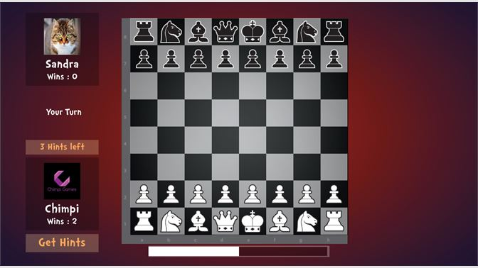

# Multiplayer Chess

MultiPlayer Chess is an interactive online chess game built with React and TypeScript for a seamless front-end experience. The project leverages Docker for efficient containerization and MongoDB for robust data management, offering a dynamic and real-time multiplayer environment.

## Project's Screenshots =>



## Technologies Used

- **React.js**
- **TypeScript**
- **Express.js**
- **Node.js**
- **JavaScript**
- **WebSockets**
- **Docker**

<h2>Getting Started</h2>

1. To get started with this project, you will need to have `Node.js` and `NPM` installed on your system.

2. First, you need to open a `Terminal` in your system and `Clone` this repository by using :

```bash
git clone https://github.com/Mk4Levi/Multiplayer-Chess.git
```

3. Navigate to the Project's directory :

```bash
cd Multiplayer-Chess
```

4. Install all Dependencies used in this Project :

```bash
npm install
```

in path frontend/ and backend/

5. Finally, host frontend on local server :

```bash
npm run start
```

6. and host backend on local server :

```bash
npm run dev
```

## Thank You
